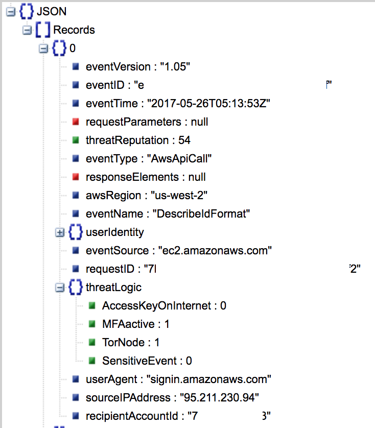
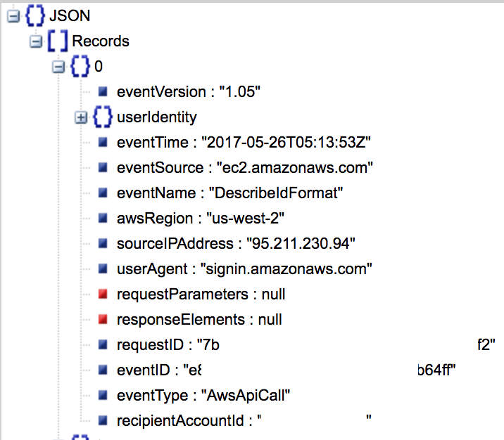

# forensic-tools
Scripts I write inspired by work done at The Crypsis Group that I write in full-on downtime so I know I can freely open source.

## MBOXparse.py

Parses MBOX files into a JSON file to make it easier to ingest into mass analysis and programming. PSTs, though with potential loss, can be converted to MBOX using readpst on Linux (part of libpst).

## threatIndexes.py

This script is used with the intention of providing further context to CloudTrail logs. It accepts (non-gzipped, non-flattened) JSON files that come from CloudTrail. 

There should be no necessary dependencies other than an internet connection. AccessKeyOnInternet needs tweaking in the immediate future in the event Google throws unexpected behavior.

While some details were sensitive and redacted as a result, please note the difference below:

With threat indexing, you may notice the `threatReputation` score out of 100 and the `threatLogic` array that elaborates on how it reached that score.

For reference, here is the JSON object without threat indexing. 

